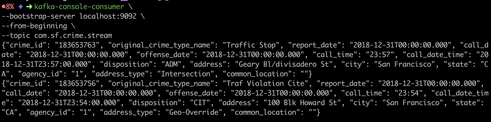
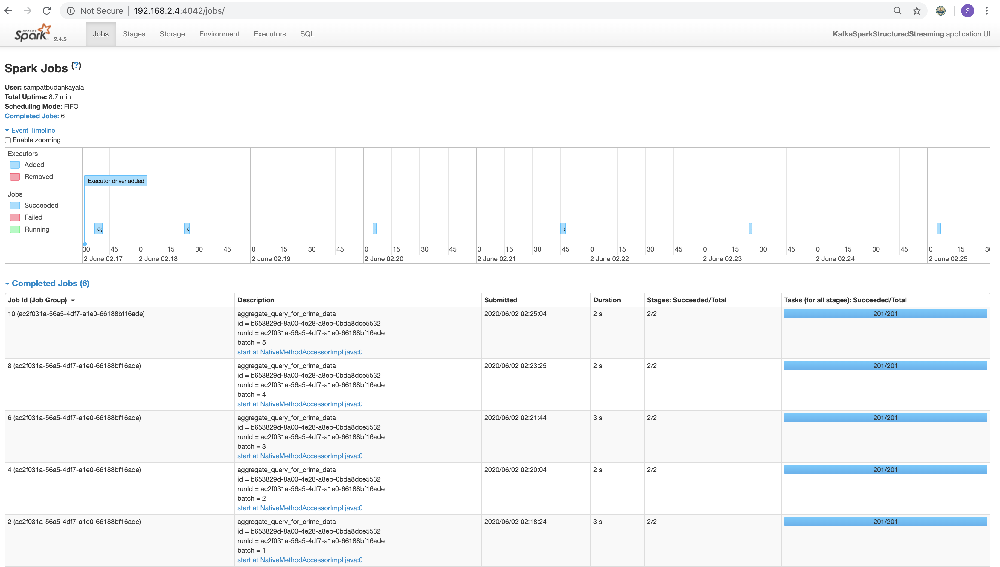

## Spark_Streaming_SF_Crime_Data

##Overview
Analysis of SF crimedata analytics. Below are scripts used to run this project.

* Kafka Environment setup using below docker image.
 
` docker run -d -p 2181:2181 -p 3030:3030 -p 8081-8083:8081-8083 \
           -p 9581-9585:9581-9585 -p 9092:9092 -e ADV_HOST=127.0.0.1 \
           -e CONNECTORS=debezium-mysql lensesio/fast-data-dev`
           
* Running Kafka Producer using script
    
    ``python3.7 kafka_server.py``
           
* Analyse Kafka Stream Data with PySpark using script

    ``spark-submit --packages org.apache.spark:spark-sql-kafka-0-10_2.11:2.4.5 data_stream.py``

###Kafka Consumer console output





##Performance Tunning Questions

Q) How did changing values on the SparkSession property parameters affect the throughput and latency of the data?

Answer) Higerthrough put increases the number of ```processedRowsPerSecond```

Q) What were the 2-3 most efficient SparkSession property key/value pairs? Through testing multiple variations on values, how can you tell these were the most optimal?

Answer) Below are settings are useful inorder increase the ```processedRowsPerSecond```
            
  * spark.sql.shuffle.partitions
  * spark.default.parallelism
  * spark.streaming.kafka.maxRatePerPartition


